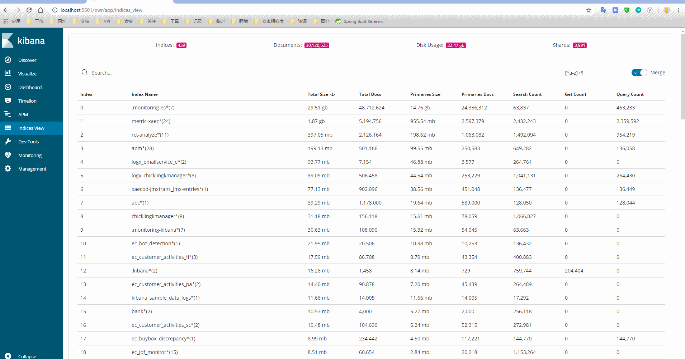

# indices_view

> An awesome kibana plugin to view indices!

---

## Screenshots


## Reg pattern

```
1. /[^a-z]+$/
2. /[\d]{4}[-|\.|/][\d]{1,2}[-|\.|/][\d]{1,2}/
```
## Development

See the [kibana contributing guide](https://github.com/elastic/kibana/blob/master/CONTRIBUTING.md) for instructions setting up your development environment. Once you have completed that, use the following npm tasks.

  - `npm start`

    Start kibana and have it include this plugin

  - `npm start -- --config kibana.yml`

    You can pass any argument that you would normally send to `bin/kibana` by putting them after `--` when running `npm start`

  - `npm run build`

    Build a distributable archive

  - `npm run test:browser`

    Run the browser tests in a real web browser

  - `npm run test:server`

    Run the server tests using mocha

For more information about any of these commands run `npm run ${task} -- --help`.

## Deploy

**Important** : Edit this plugin version and kibana.version to you kibana version in package.json

- `npm install`
- `npm run build`

Build a distributable archive

## Install

1. cp to docker container

    ```$ sudo docker cp ****.zip id:/****.zip```

2. install to kibana 

    ```$bin/kibana-plugin install file:///****.zip```